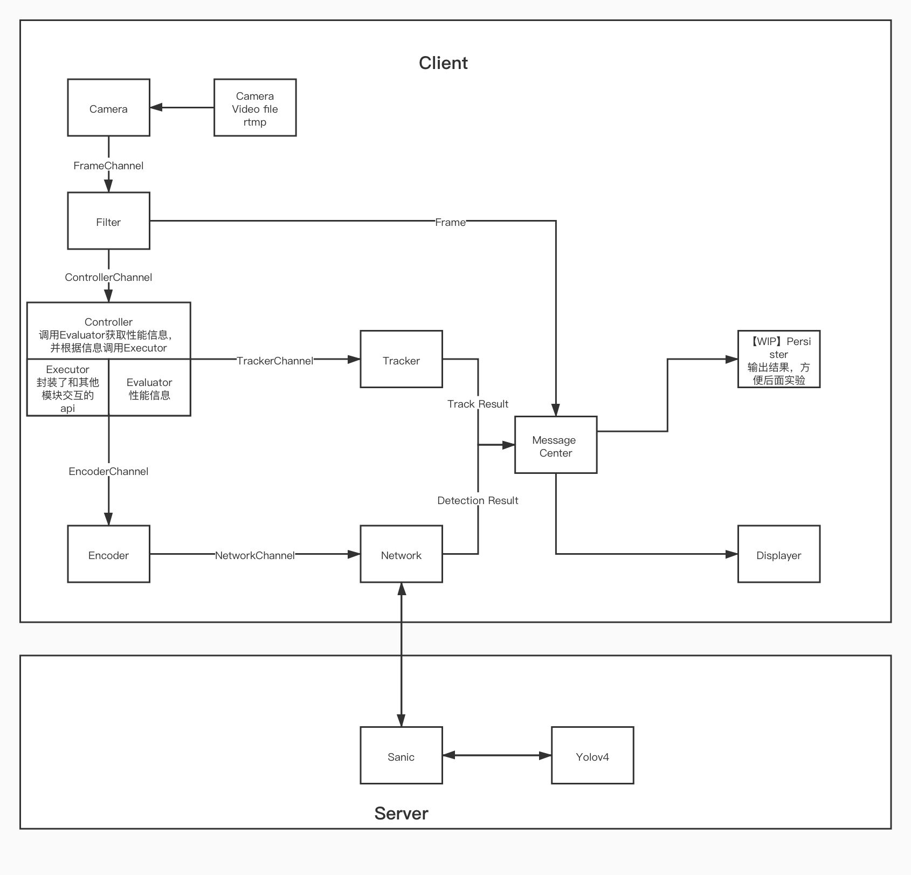

# Yet Another Graduation Project

不知道怎么起名了                  

```
.
├── README.md
├── client                                  client端代码
│   ├── camera.go
│   ├── client.go
│   ├── controller.go
│   ├── displayer.go
│   ├── encoder.go
│   ├── evaluator.go
│   ├── filter.go
│   ├── go.mod
│   ├── go.sum
│   ├── message_center.go
│   ├── network.go
│   ├── persister.go
│   └── tracker.go
└── sanic                                   server端代码
    ├── app
    │   └── yolov4                          https://github.com/Tianxiaomo/pytorch-YOLOv4修改得来
    │       ├── __init__.py                 可以在这修改是否使用GPU，使用完整模型还是tiny
    │       ├── cfg
    │       ├── data
    │       ├── tool
    │       └── weight
    │           ├── download.sh             这里下载权重之后应该就能跑了
    └── main.py
```



## Prerequisites

- [Go](https://golang.org/)：建议使用1.15版本
- [GoCV](https://gocv.io/)
- [python](https://www.python.org/)：3.6+
- [pytorch](https://pytorch.org/)：应该1.0版本以上就行

## Getting Started

```
git clone https://github.com/yemq3/yagp.git
cd yagp
```

### Server

#### Download weights

如果你在linux系统你可以直接

```
cd sanic/app/yolov4/weight/
sudo chmod +x download.sh
./download.sh
```

如果你在windows系统，你可以去下面两个链接下完之后丢进weight里面

[yolov4.weights](https://github.com/AlexeyAB/darknet/releases/download/darknet_yolo_v3_optimal/yolov4.weights)

[yolov4-tiny.weights](https://github.com/AlexeyAB/darknet/releases/download/darknet_yolo_v4_pre/yolov4-tiny.weights)

#### Run

```
cd sanic
pip install sanic
python main.py
```

### Client

先按照[GoCV](https://gocv.io/getting-started/)的指引安装好gocv，如果你的gocv版本和我不对应，先去client下的go.mod修改gocv版本到你的版本

```
module yagp

go 1.15

require (
	github.com/gorilla/websocket v1.4.2
	github.com/sirupsen/logrus v1.7.0
	gocv.io/x/gocv v0.26.0              change here
)
```

#### Run

```
cd client
go run .
```

## 一些开发指引

- 如果你需要Frame，Detection Result这些数据，可以给自己的模块加个messageCenter对象，然后调用messageCenter的Subscribe方法拿到通知所用的channel（可以参考其他模块比如Persister），不知道Topic是什么的话，去对应的模块找一下调用Publish方法的地方就知道了
- 遇到问题问下我就懂了（逃

## TODO

- [ ] 历史帧到达一定数量后自动删除
- [ ] 更细致的日志信息
- [ ] 对网络情况的自适应
- [ ] Frame Scheduler
- [ ] gzip压缩（需要连接双方协商，不过测试下来gzip和zlib对图片的压缩率都不高）